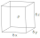

# CFD - Mathematical Theory

## Navier-Stokes equation

 $$\Large \dfrac{\partial\vec{\mathbf{v}}}{\partial t} + (\vec{\mathbf{v}}\cdot \nabla)\vec{\mathbf{v}} = - \dfrac{\nabla p}{\rho} + \nu \nabla^2 \vec{\mathbf{v}}$$

On the left side of the equation is the acceleration part.

$\dfrac{\partial\vec{\mathbf{v}}}{\partial t} \text{ - unsteady term}$

$(\vec{\mathbf{v}}\cdot \nabla)\vec{\mathbf{v}} \text{ - convective acceleration, nonlinear term}$

$\dfrac{\nabla p}{\rho} \text{ - pressure gradient, density is const.}$

$\nu \nabla^2 \vec{\mathbf{v}} \text{ - viscosity of newtonian fluid, 2nd order term}$

We solve 2nd order, nonlinear, partial derivative equation.

As solution we expect:

 - The velocity field (vectors)
 - The associated pressure (scalar)

## Euler equation

For inviscid fluid  $\Rightarrow \nu = 0$

Then we get  the Euler equation:

$$\Large \dfrac{\partial\vec{\mathbf{v}}}{\partial t} + (\vec{\mathbf{v}}\cdot \nabla)\vec{\mathbf{v}} = - \dfrac{\nabla p}{\rho}$$

## Model and discretize

1 - __The mathematical model__ - Set of partial differential or integral-differential equation

Target application

- incompressible
- inviscid
- turbulent
- 2D or 3D

2 - __The discretization method__

Method for approximating the PDES by a system of algebraic equations

$\mathcal{L}[u(\underline{x})] = f(\underline{x}) \Rightarrow A\underline{x} = b$

Differential operator L is a function of x

- finite difference, FD
- finite volume, FV
- finite elements, FE
- spectral methods
- boundary element method, BEM
- particle methods

3 - __Analyze the numerical scheme__

All numerical schemes must satisfy certain conditions to be accepted:

- consistency
- stability
- convergence

Need for analyze the accuracy

4 - __Solve__

Obtain grid/point values of all flow variables

- time-dependent $\Rightarrow$ DDES - time integrators
- steady $\Rightarrow$ algebraic system of equations - linear solvers

## Differential form of the Fluid Equations

1 - __Conservation of Mass__

For a system: $\dfrac{\mathrm d M_{sys}}{\mathrm d t}=0$

For a Control Volume: $\dfrac{\partial}{\partial t}\int_{cv}\rho\cdot\mathrm d V + \int_{cs}\rho\vec{\mathbf{v}}\cdot\hat{n}\cdot\mathrm d A = 0$

$\dfrac{\partial}{\partial t}\int_{cv}\rho\cdot\mathrm d V$ - Rate of change of mass in Control volume CV

$\int_{cs}\rho\vec{\mathbf{v}}\cdot\hat{n}\cdot\mathrm d A$ - Net rate of flow of mass across Control surfaces CS ($\hat{n}$ - normal, A - Area)

<u>Differential Form</u> - consider a small fluid element $\delta x \delta y \delta z$

1. $\dfrac{\partial}{\partial t}\int_{cv}\rho\cdot\mathrm d V = \dfrac{\partial\rho}{\partial t}\delta x \delta y \delta z$, $\rho$ is uniform in $\delta V$

2. Rate of mass flow: in the x-direction

$\delta \rightarrow$  $\rightarrow$

$\delta \rightarrow$  $\rightarrow$
