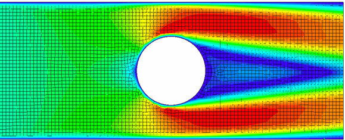

# CFD with Machine Learning

## Introduction

### Main goal

Main goal of this project is to build a predicting mathematical model, which can substitute the original CFD equations in simulations on before unseen geometry in the flow field.

### Motivation

CFD equations are computationaly very demanding. To be honest, I have to state, that in the very begining of this project I can't be sure if Machine Learning methods are able to substitute (fully or partly) traditional CFD procedure or even make it faster. Therefore in the first phase it should be considered more as an academic assignment.

### Steps

- understand CFD mathematical theory
- implement CFD into python code
- make simulating enviroment
- produce training data
- build predicting model
- evaluation of the predicting model
- comparison ML approach to traditional CFD
- conclusion
